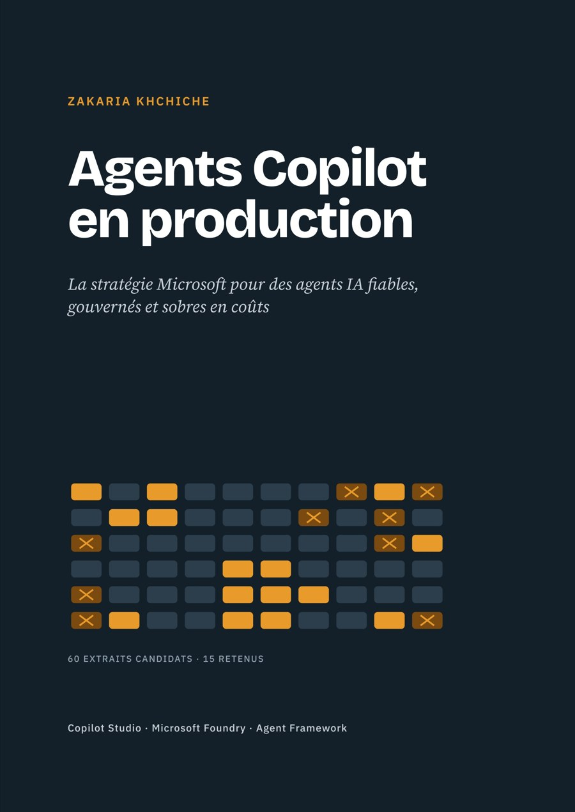

# Agents Copilot en production

**La stratégie Microsoft pour des agents IA fiables, gouvernés et sobres en coûts**

Zakaria Khchiche · Première édition, octobre 2026



**[Lire le livre en PDF](pdf/Agents-Copilot-en-production.pdf)** (100 pages, liens cliquables, à partager librement) · [Texte source en Markdown](source/livre.md)

## Pourquoi ce livre

Un prototype d'agent se construit en une journée. Un agent en production se construit en quelques semaines : il doit répondre juste, savoir se taire, résister aux abus, coûter un prix connu et être maintenu.

J'ai mis plus de 200 agents IA en production chez SUEZ. Ce livre rassemble la méthode que j'applique, sur la pile Microsoft de 2026 : Copilot Studio et ses trois harnais, Microsoft Foundry, Azure AI Search, Microsoft Agent Framework, MCP, la gouvernance Power Platform, Entra et Purview, et l'AI Act.

Il s'adresse aux chefs de projet comme aux équipes techniques.

## La thèse en trois règles

1. **Un périmètre étroit** avec des données propres, élargi plus tard.
2. **Un agent mesuré** : un jeu de questions réelles, rejoué à chaque changement.
3. **Le modèle comprend, le déterministe décide** : les règles de gestion vont dans des flux, pas dans le prompt.

## Sommaire

| | Chapitre |
|---|---|
| | Avant-propos : pour qui, pourquoi, comment lire ce livre |
| 1 | Pourquoi la plupart des agents restent au stade du prototype |
| 2 | La pile Microsoft des agents en 2026 (dont le choix de l'harnais) |
| 3 | Cadrer : choisir le bon cas d'usage et définir le succès |
| 4 | Concevoir l'agent : instructions, sujets et part du déterministe |
| 5 | Les connaissances : documents, recherche et les extraits qui comptent |
| 6 | Les outils : connecteurs, flux d'agent, MCP et autres agents |
| 7 | Fiabilité et résilience : un agent qui sait échouer proprement |
| 8 | Évaluer : la mesure qui rend tout le reste possible |
| 9 | Sécurité, gouvernance et AI Act |
| 10 | Le coût : modéliser, puis optimiser |
| 11 | Exploiter : ALM, déploiement et maintenance |
| 12 | Adoption, formation et organisation |
| 13 | La feuille de route : un premier agent en 90 jours |
| | Étude de cas : l'agent qui lit des milliers de contrats |
| | Annexes : checklist de mise en production, gabarits, calcul du coût, glossaire, sources |

Chaque chapitre ouvre sur l'essentiel et se termine par un piège fréquent et une checklist.

## Contenu du dépôt

```
pdf/Agents-Copilot-en-production.pdf                  le livre, édition numérique avec liens cliquables
pdf/Agents-Copilot-en-production_impression-17x24.pdf  l'intérieur prêt à imprimer (17 × 24 cm, 108 pages)
source/livre.md                        le texte intégral en Markdown
figures/                               les schémas du livre (SVG)
couverture/couverture.jpg              la première de couverture
couverture/couverture-impression.pdf   la couverture complète (4e, dos, 1re), fond perdu 3 mm
```

## Code associé

L'étude de cas s'appuie sur un dépôt open source : [copilot-studio-knowledge-rerank](https://github.com/Zakariakhchiche/copilot-studio-knowledge-rerank), qui montre comment choisir les extraits que lit un agent Copilot Studio.

## Sources et mises à jour

Les fonctionnalités, limites et tarifs ont été vérifiés dans la documentation officielle Microsoft en octobre 2026 ; toutes les sources sont listées en annexe E. La pile Microsoft évolue vite : vérifiez toujours la page officielle avant un engagement. Les passages sur l'AI Act sont informatifs et ne constituent pas un conseil juridique.

Une erreur, une information dépassée ? Ouvrez une issue : les corrections seront intégrées dans la prochaine édition.

## Former vos équipes

J'anime avec Spar-x, organisme certifié Qualiopi, une formation Copilot Studio qui suit la méthode du livre : chaque participant repart avec un agent construit sur son propre cas d'usage. Finançable par votre OPCO, 20 participants au plus.

- [Programme de la formation Copilot Studio](https://zakariakhchiche.github.io/formation-copilot-studio/)
- [Demander un devis](https://mte.typeform.com/spar-xv3?typeform-source=www.spar-x.fr)
- [Kit AI Act article 4, gratuit](https://zakariakhchiche.github.io/kit-ai-act/)

## L'auteur

Zakaria Khchiche, Tech Lead Data & IA à Paris · [LinkedIn](https://www.linkedin.com/in/zakariakhchiche/) · [Site](https://zakariakhchiche.github.io/) · [Medium](https://medium.com/@ZKHCHICHE)

## Droits

© 2026 Zakaria Khchiche. Tous droits réservés. Vous pouvez lire le livre et partager le lien de ce dépôt librement. Toute reproduction ou diffusion de tout ou partie du contenu, hors courte citation avec mention de la source, demande l'accord de l'auteur. Voir [LICENSE](LICENSE).

Microsoft, Copilot, Azure et les autres noms de produits cités sont des marques de leurs propriétaires. Cet ouvrage est indépendant : il n'est ni approuvé ni parrainé par Microsoft.
